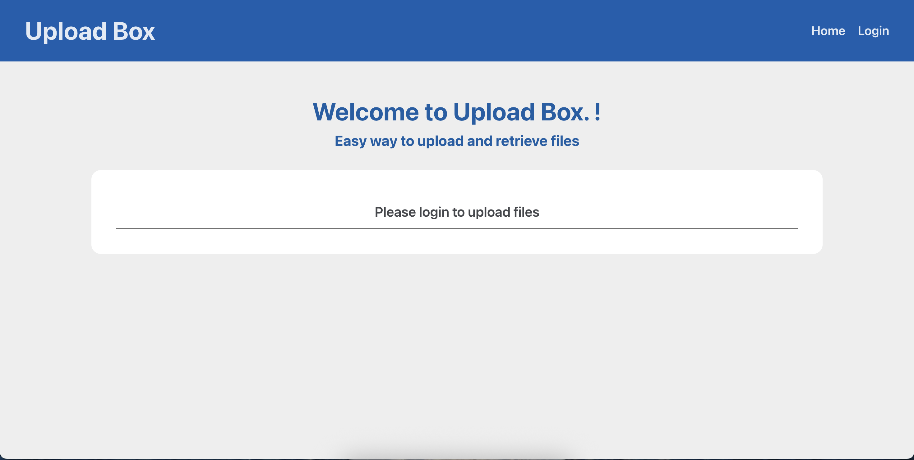
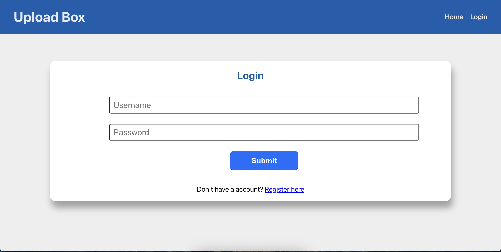
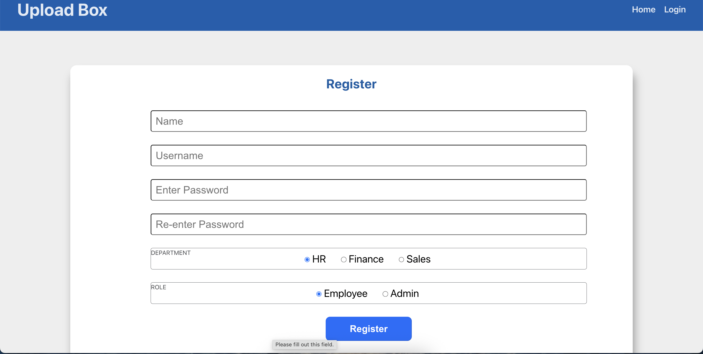
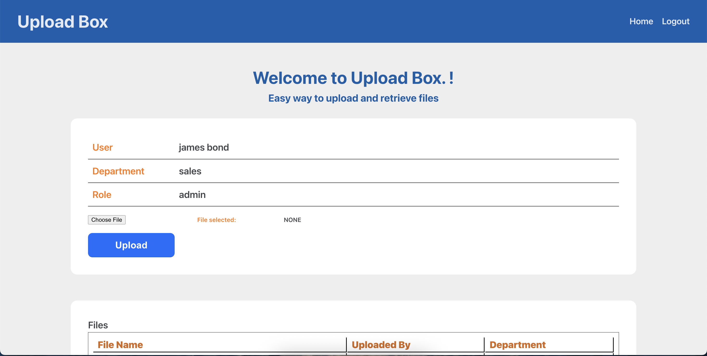

# Upload Box

This project is a React webapp for the **Project Phase 4**.

User can register their account and then upload files.

The uploaded files are visible only to the owner and other user from the same department.

If a user has **admin** role then he/she can see all the files.

To run this project

1. Download the code.
2. cd into the project folder (UploadBox).
3. run **npm install**
4. run **npm run dev**

## Home Screen

## User Login Screen

## User Register Screen

## Dashboard Screen

